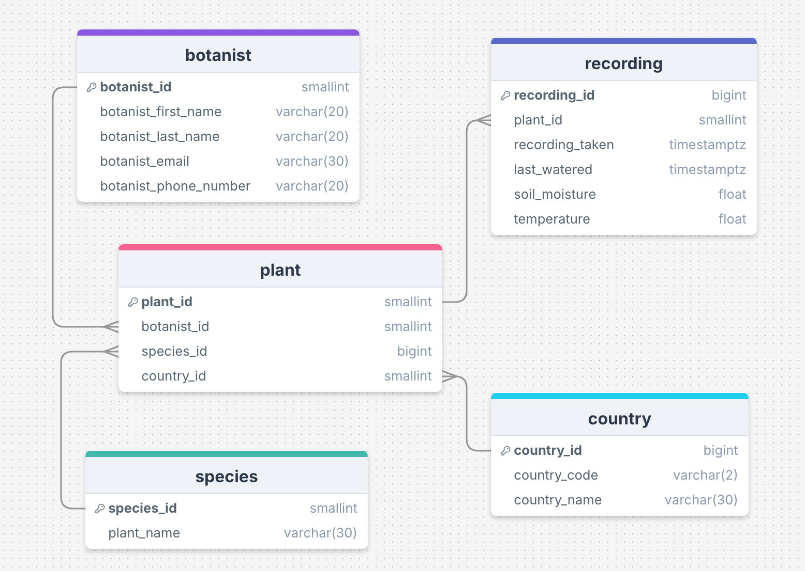
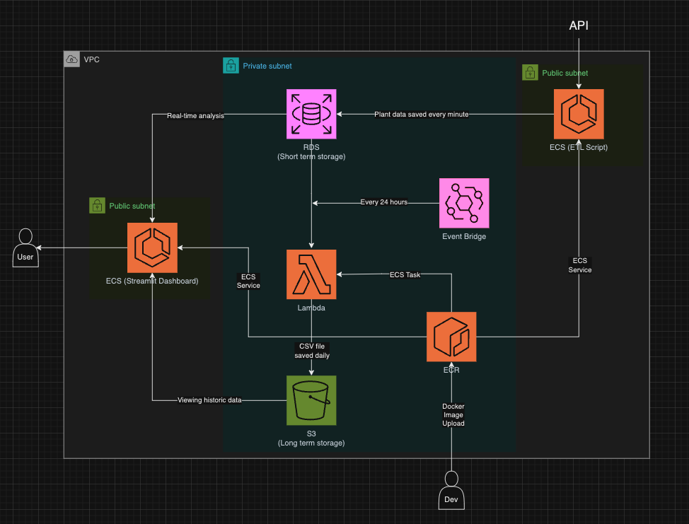

# LMNH Plant Health Monitor

### Database ERD:

### AWS Architecture Diagram

### Terraform Configuration:
The `terraform` folder contains all files for terraform infrastructure:
- `provider.tf` - defines the AWS region.
- `s3_bucket.tf` - provisioning the AWS S3 bucket for long-term data storage (data older than 24hrs).
  
One script for each of the 3 ECRs utilised in this project:
- `etl_ecr.tf` - contains the image for the `ETL` script which is run every minute
- `data_backup_ecr.tf` - contains the image for the backup script which moves data to long-term storage every 24hrs. 
- `dashboard_ecr.tf` - contains the image to run the streamlit dashboard for visualisations
- Each ECR has a lifecycle policy which keeps only the 30 most recently pushed images.